# DevOps Bootcamp Final Project

This repository contains my DevOps Bootcamp final project, implementing a complete AWS-based application deployment and monitoring environment using Terraform, Ansible, Docker, Amazon ECR, Prometheus, Grafana, Cloudflare, and GitHub Actions.

## Live URLs

## Live URLs

| Resource | URL |
|---|---|
| Web Application | https://web.amirulcloud.com |
| Monitoring / Grafana | https://monitoring.amirulcloud.com |
| GitHub Repository | https://github.com/iximiz/devops-bootcamp-project1 |
| Project Documentation (GitHub Pages) | https://iximiz.github.io/devops-bootcamp-project1/ |

## Architecture Overview

The project uses three AWS EC2 instances with separate responsibilities:

| Server             | Network        |   Private IP | Role                                         |
| ------------------ | -------------- | -----------: | -------------------------------------------- |
| Web Server         | Public Subnet  |   `10.0.0.5` | Docker application and Node Exporter         |
| Ansible Controller | Private Subnet | `10.0.0.135` | Infrastructure configuration through Ansible |
| Monitoring Server  | Private Subnet | `10.0.0.136` | Prometheus, Grafana and Cloudflare Tunnel    |

The web server is accessible through an Elastic IP and Cloudflare, while the Ansible controller and monitoring server remain inside the private subnet.

Private servers are managed through AWS Systems Manager (SSM) without exposing SSH port 22.

### Application Traffic

```text
User
  |
  | HTTPS
  v
Cloudflare
  |
  v
web.amirulcloud.com
  |
  v
Web EC2 - 10.0.0.5
  |
  v
Docker Container - Port 80
```

### Monitoring Traffic

```text
Web EC2 - 10.0.0.5
  |
  | Node Exporter :9100
  v
Prometheus - 10.0.0.136:9090
  |
  v
Grafana - 10.0.0.136:3000
  |
  v
Cloudflare Tunnel
  |
  v
monitoring.amirulcloud.com
```

---

## 1. Terraform Backend

Terraform is used to provision and manage the AWS infrastructure.

The Terraform state is stored remotely in an Amazon S3 backend.

* Region: `ap-southeast-1`
* Remote state: Amazon S3
* Terraform backend configuration: `Terraform/backend.tf`

This allows the infrastructure state to be stored remotely instead of relying only on a local Terraform state file.

---

## 2. VPC Network

The AWS network is provisioned using Terraform.

### VPC

* Name: `devops-vps`
* CIDR: `10.0.0.0/24`

### Subnets

**Public Subnet**

* Name: `devops-public-subnet`
* CIDR: `10.0.0.0/25`
* Hosts the Web Server

**Private Subnet**

* Name: `devops-private-subnet`
* CIDR: `10.0.0.128/25`
* Hosts the Ansible Controller and Monitoring Server

### Route Tables

* `devops-public-route`
* `devops-private-route`

### Gateways

* Internet Gateway: `devops-igw`
* NAT Gateway: `devops-ngw`

The public subnet uses the Internet Gateway for Internet connectivity. Private instances use the NAT Gateway for outbound Internet access without requiring public exposure.

---

## 3. Security Groups

Separate security groups are used for public and private infrastructure.

### Web Server

The Web Server security group permits required application traffic.

* HTTP: Port `80`
* HTTPS: Port `443`
* Node Exporter: Port `9100` accessible only from Monitoring Server `10.0.0.136/32`

SSH port `22` is not required for Ansible management.

### Private Servers

The Ansible Controller and Monitoring Server remain private and are accessed using AWS Systems Manager.

The Monitoring Server does not require a public IP address.

---

## 4. EC2 Servers

Three EC2 instances provide three different roles.

### Web Server

* Private IP: `10.0.0.5`
* Public subnet
* Elastic IP
* Runs the application container
* Runs Node Exporter
* Application exposed on port `80`

### Ansible Controller

* Private IP: `10.0.0.135`
* Private subnet
* Runs Ansible configuration and deployment
* Connects to managed servers through AWS SSM

### Monitoring Server

* Private IP: `10.0.0.136`
* Private subnet
* Runs Prometheus
* Runs Grafana
* Runs Cloudflare Tunnel

---

## 5. AWS Systems Manager

AWS Systems Manager instance profiles are attached to all three EC2 instances through Terraform.

SSM is used as the management path to private instances.

The Ansible inventory uses the `community.aws.aws_ssm` connection plugin, allowing Ansible to manage the infrastructure without opening SSH port `22`.

Example inventory:

```ini
[web]
web-server ansible_host=i-0bfbcd6645ab871aa

[monitoring]
monitoring-server ansible_host=i-0fa21ebee25cd99d8

[all:vars]
ansible_connection=community.aws.aws_ssm
ansible_aws_ssm_region=ap-southeast-1
```

---

## 6. Ansible Automation

Ansible configuration is stored under:

```text
Ansible/
```

The project includes playbooks for:

* Docker installation
* Application deployment
* Node Exporter deployment
* Prometheus and Grafana deployment

Docker is installed using the Ansible Galaxy role:

```text
geerlingguy.docker
```

Required roles and collections are defined in:

```text
Ansible/requirements.yml
```

### Repeatable Configuration

The Ansible playbooks are designed to be repeatable.

The Node Exporter playbook was executed repeatedly and returned:

```text
web-server : ok=13 changed=0 unreachable=0 failed=0
```

This demonstrates idempotent configuration where no unnecessary changes are made when the desired configuration already exists.

---

## 7. Docker and Amazon ECR

The application is based on the Infratify Ship project.

Source application:

```text
https://github.com/Infratify/ship
```

A custom multi-stage Dockerfile is used.

### Build Stage

```dockerfile
FROM node:22-alpine AS build
```

The application dependencies are installed, tests are executed, and the application is built.

### Runtime Stage

```dockerfile
FROM nginx:alpine
```

Only the built application files are copied into the final Nginx image.

The resulting image is pushed to the private Amazon ECR repository:

```text
devops-bootcamp/final-project-amirul
```

The Web Server pulls this image from ECR and runs the application as a Docker container on port `80`.

---

## 8. Monitoring Stack

The monitoring stack runs as containers on the private Monitoring Server.

The stack contains:

* Prometheus
* Grafana

Ansible sends the Docker Compose and Prometheus configuration files to the Monitoring Server.

### Node Exporter

Node Exporter runs as a Docker container on the Web Server.

```text
10.0.0.5:9100
```

Security Group access to port `9100` is restricted to:

```text
10.0.0.136/32
```

Therefore, only the Monitoring Server can access the Web Server metrics endpoint.

### Prometheus

Prometheus runs on the Monitoring Server.

```text
10.0.0.136:9090
```

Prometheus scrapes:

```text
10.0.0.5:9100
```

The Prometheus configuration is bind-mounted into the Prometheus container.

Example scrape configuration:

```yaml
scrape_configs:
  - job_name: "web-server"
    static_configs:
      - targets: ["10.0.0.5:9100"]
```

### Grafana

Grafana runs on:

```text
10.0.0.136:3000
```

Prometheus is configured as the Grafana data source.

The Grafana dashboard displays Web Server metrics including:

* CPU
* Memory
* Disk

Grafana persistent data is stored using the named Docker volume:

```text
Grafana-data
```

This preserves Grafana data even when the Grafana container is recreated.

---

## 9. Cloudflare and HTTPS

Two application paths are used.

### Web Application

```text
https://web.amirulcloud.com
```

The application is served from the public Web Server through Cloudflare.

### Monitoring

```text
https://monitoring.amirulcloud.com
```

Grafana is exposed using Cloudflare Tunnel.

The Monitoring Server remains in the private subnet and does not require direct public exposure.

The Cloudflare Tunnel connects:

```text
monitoring.amirulcloud.com
        |
        v
Cloudflare Tunnel
        |
        v
localhost:3000
        |
        v
Grafana
```

HTTPS is provided through Cloudflare.

---

## 10. CI/CD with GitHub Actions

GitHub Actions provides automated CI/CD for the project.

Workflow files are stored in:

```text
.github/workflows/
```

### Build and Push to ECR

When application changes are pushed to the `main` branch, GitHub Actions:

1. Checks out the repository.
2. Authenticates to AWS.
3. Logs in to Amazon ECR.
4. Builds the custom Docker image.
5. Pushes the latest image to Amazon ECR.

### Continuous Deployment

After the image is pushed successfully, GitHub Actions deploys the latest image to the Web Server through AWS Systems Manager.

The deployment:

1. Authenticates the Web Server to ECR.
2. Pulls the latest application image.
3. Stops and removes the previous application container.
4. Starts the new application container on port `80`.

This deployment does not require SSH access.

### Code and Configuration Checks

A separate GitHub Actions workflow validates:

* Terraform formatting
* Ansible syntax

### Terraform Plan Gate

Pull requests that modify Terraform configuration trigger:

* `terraform init`
* `terraform fmt -check`
* `terraform validate`
* `terraform plan`

This allows infrastructure changes to be reviewed before they are merged into the `main` branch.

---

## 11. Repository Structure

```text
devops-bootcamp-project1/
├── .github/
│   └── workflows/
├── Ansible/
│   ├── compose.yaml
│   ├── deploy-app.yml
│   ├── install-docker.yml
│   ├── inventory.ini
│   ├── monitoring.yml
│   ├── node-exporter.yml
│   ├── prometheus.yaml
│   └── requirements.yml
├── App/
│   ├── Dockerfile
│   └── ...
├── Terraform/
│   ├── backend.tf
│   ├── ec2.tf
│   ├── iam.tf
│   ├── network.tf
│   ├── outputs.tf
│   └── security.tf
├── docs/
│   └── screenshots/
└── README.md
```

---

## 12. Deployment Guide

### Terraform

Initialize Terraform:

```bash
terraform -chdir=Terraform init
```

Check formatting:

```bash
terraform -chdir=Terraform fmt -check -recursive
```

Review the infrastructure plan:

```bash
terraform -chdir=Terraform plan
```

Apply infrastructure:

```bash
terraform -chdir=Terraform apply
```

### Ansible

Connect to the Ansible Controller using AWS Systems Manager.

Install the required Ansible dependencies:

```bash
ansible-galaxy install -r requirements.yml
```

Install Docker:

```bash
ansible-playbook -i inventory.ini install-docker.yml
```

Deploy Node Exporter:

```bash
ansible-playbook -i inventory.ini node-exporter.yml
```

Deploy monitoring:

```bash
ansible-playbook -i inventory.ini monitoring.yml
```

Deploy the application:

```bash
ansible-playbook -i inventory.ini deploy-app.yml
```

---

## 13. Verification

### Web Application

```bash
curl -I https://web.amirulcloud.com
```

Expected response:

```text
HTTP/2 200
```

### Monitoring

```bash
curl -I https://monitoring.amirulcloud.com
```

Expected response:

```text
HTTP/2 302
location: /login
```

### Node Exporter

Node Exporter can be reached by the Monitoring Server:

```bash
curl http://10.0.0.5:9100/metrics
```

Access from outside the permitted Monitoring Server is restricted by the Security Group.

---

## 14. Screenshots and Evidence

The following screenshots provide evidence of the deployed infrastructure, automation, monitoring, and CI/CD implementation.

### Terraform Backend

Amazon S3 is used as the remote backend for Terraform state.

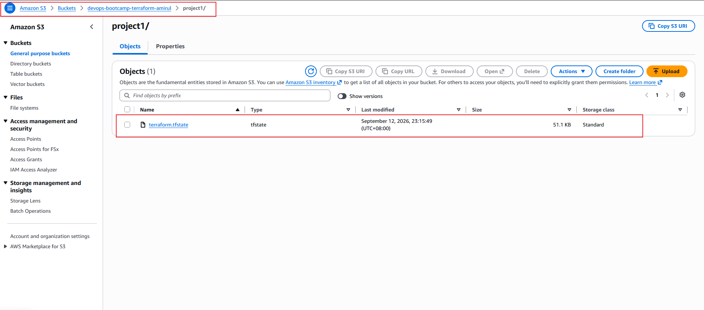

### AWS VPC Network

The infrastructure uses one VPC with separate public and private subnets, route tables, an Internet Gateway, and a NAT Gateway.

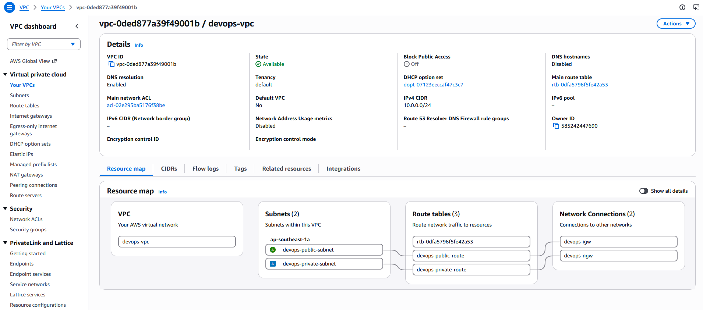

### EC2 Instances

Three EC2 instances are deployed with separate responsibilities: Web Server, Ansible Controller, and Monitoring Server.

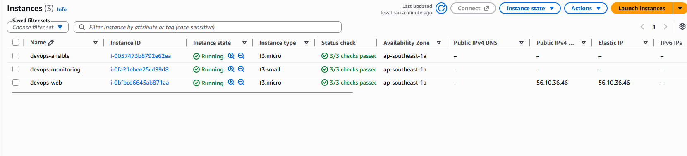

### Security Group

Node Exporter port `9100` on the Web Server is restricted to the Monitoring Server at `10.0.0.136/32`.

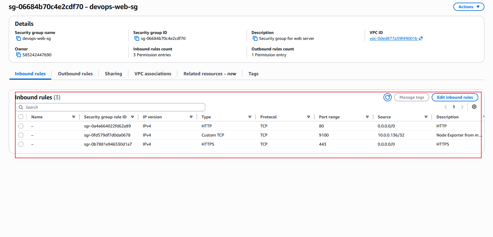

### AWS Systems Manager Access

AWS Systems Manager provides access to the private infrastructure without requiring direct SSH access.

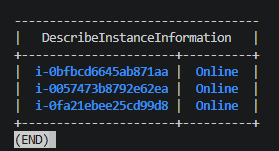

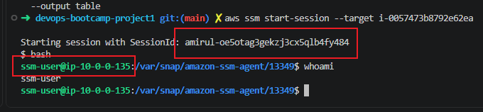

### Ansible Idempotency

Ansible configuration can be executed repeatedly without making unnecessary changes. A repeated execution returns `changed=0` and `failed=0`.

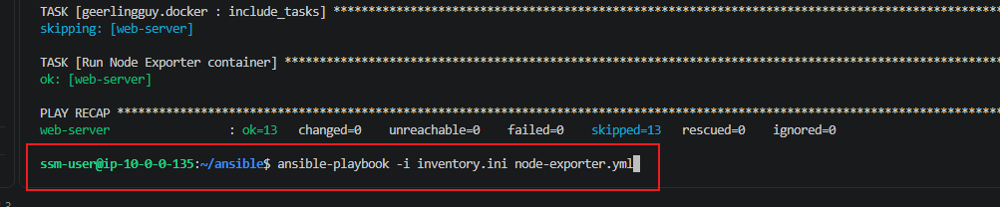

### Amazon ECR

The custom application Docker image is stored in the private Amazon ECR repository `devops-bootcamp/final-project-amirul`.

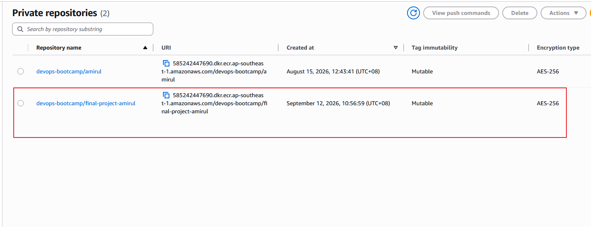

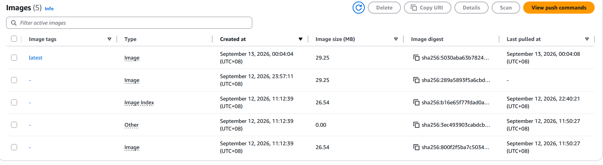

### Web Application

The containerized application is publicly accessible through HTTPS at `web.amirulcloud.com`.

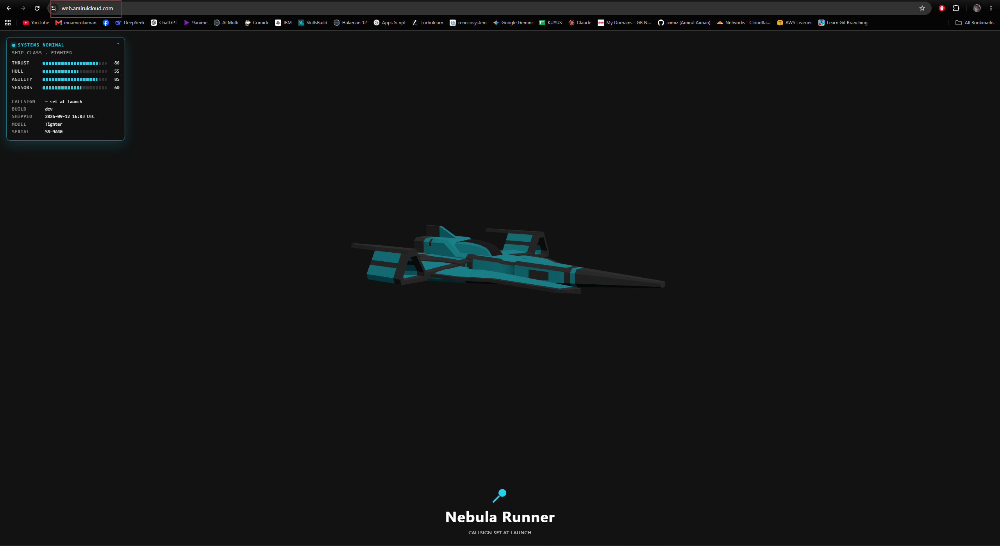

### Prometheus

Prometheus successfully scrapes Node Exporter metrics from the Web Server at `10.0.0.5:9100`.

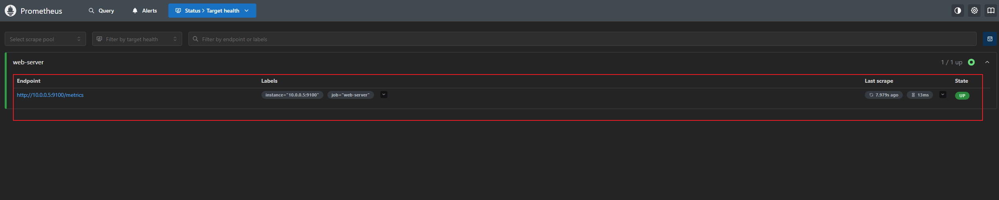

### Grafana Dashboard

Grafana visualizes CPU, memory, and disk metrics collected from the Web Server.

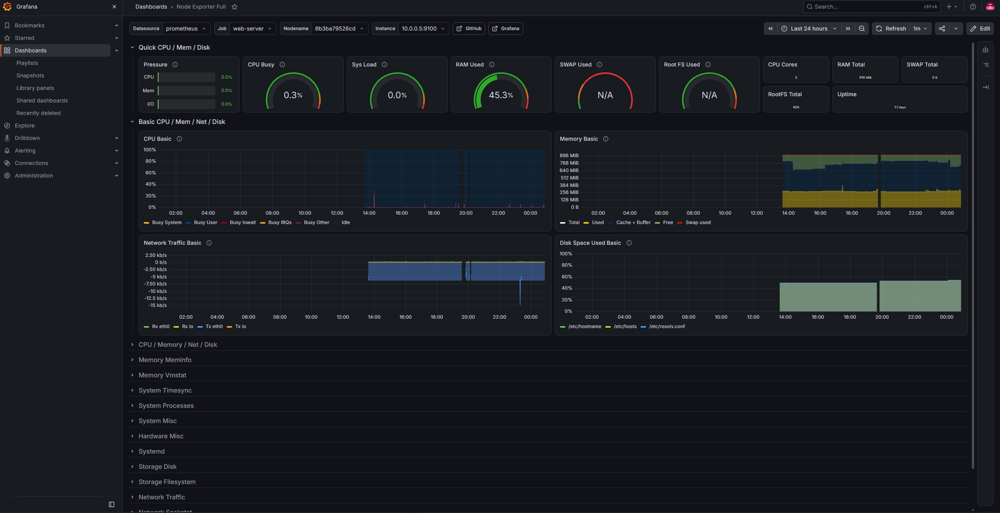

### Cloudflare Tunnel

The private Monitoring Server exposes Grafana securely through Cloudflare Tunnel without requiring a public IP address.

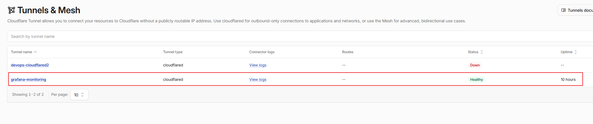

### CI/CD Pipeline

GitHub Actions automatically builds the application image, pushes it to Amazon ECR, and deploys the latest image to the Web Server.

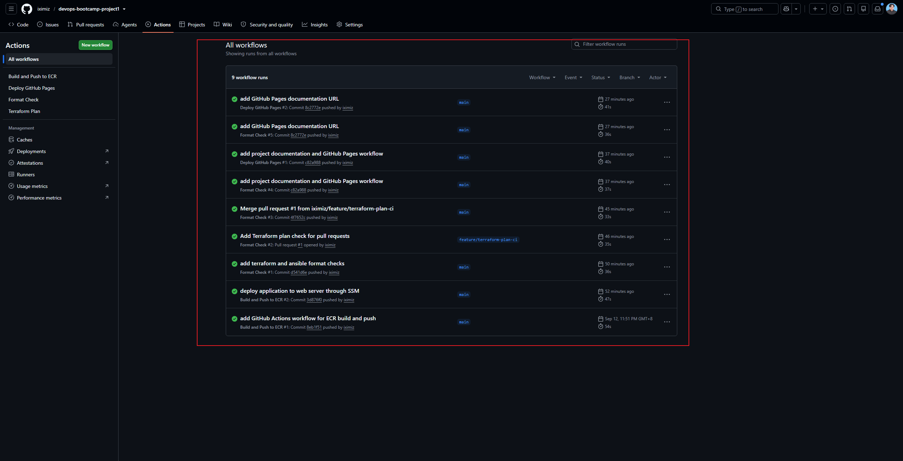

### Terraform Plan Gate

Terraform infrastructure changes are validated through a pull request workflow before being merged into the `main` branch.

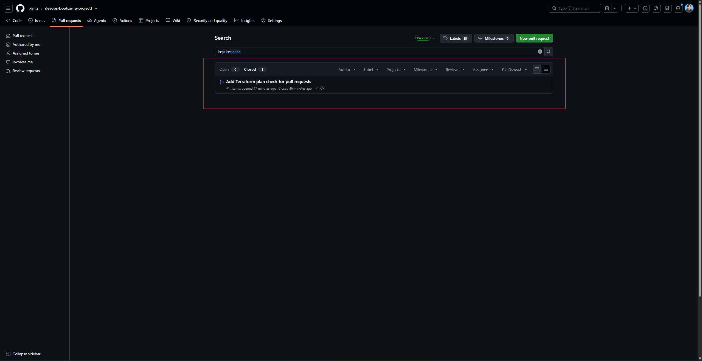

---

## 15. Bonus Implementations

The project includes the following additional implementations:

* Infrastructure as Code coverage using Terraform and Ansible
* CI/CD Docker image build and push to Amazon ECR
* CI/CD application deployment to the Web Server
* Automated Terraform and Ansible checks
* Terraform Plan validation on pull requests
* Ansible management through AWS SSM without opening port 22

---

## Project Links

**Application:**  
https://web.amirulcloud.com

**Monitoring:**  
https://monitoring.amirulcloud.com

**Repository:**  
https://github.com/iximiz/devops-bootcamp-project1

**GitHub Pages Documentation:**  
https://iximiz.github.io/devops-bootcamp-project1/
